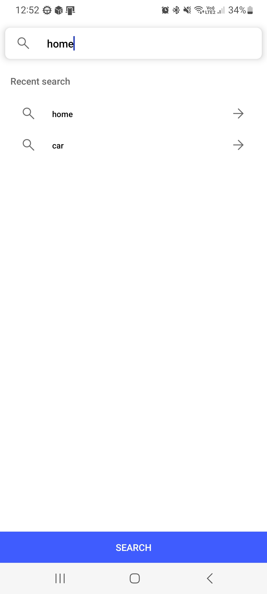
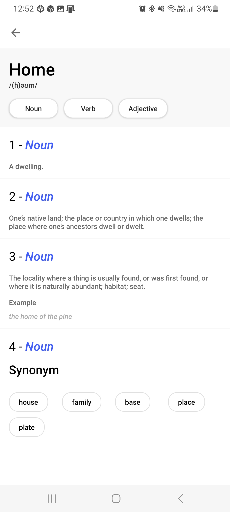

# Offline Chat
#### With the Android P2P tool, devices connected to the same network create a user server, that is, client users connected to the chat room can see all chat rooms, then connect and start the chat 🏗

### Tasks
- [ ] Introduction screen: Opening a hotspot, creating a chat and connecting to a chat https://github.com/AppIntro/AppIntro | create:👤 Ferhat OZCELIK
- [ ] Wifi Connect Check | create:👤 Ferhat OZCELIK
- [ ] Chat UI Edit: fragment_chat.xml, left.xml and right.xml modern UI desing | create:👤 Ferhat OZCELIK
- [ ] Progress Bar: All progress add | create:👤 Ferhat OZCELIK

### Build With 🏗️
- [Kotlin] - Programming language for Android
- [Hilt-Dagger] - Standard library to incorporate Dagger dependency injection into an Android application.
- [Retrofit] -  A type-safe HTTP client for Android and Java.
- [Room] - SQLite object mapping library.
- [Coroutines] - For asynchronous
- [LiveData] - Data objects that notify views when the underlying database changes.
- [ViewModel] - Stores UI-related data that isn't destroyed on UI changes.
- [ViewBinding] - Generates a binding class for each XML layout file present in that module and allows you to more easily write code that interacts with views.
- [Jetpack Navigation] - Navigation refers to the interactions that allow users to navigate across, into, and back out from the different pieces of content within your app

  [ViewModel]: <https://developer.android.com/topic/libraries/architecture/viewmodel>
  [Jetpack Navigation]: <https://developer.android.com/guide/navigation/>
  [Hilt-Dagger]: <https://dagger.dev/hilt/>
  [DataStore]: <https://developer.android.com/topic/libraries/architecture/datastore>
  [ViewBinding]: <https://developer.android.com/topic/libraries/view-binding>
  [LiveData]: <https://developer.android.com/topic/libraries/architecture/livedata/>
  [Retrofit]: <https://square.github.io/retrofit/>
  [ViewModel]: <https://developer.android.com/topic/libraries/architecture/viewmodel>
  [Kotlin]: <https://kotlinlang.org>
  [Coroutines]: <https://kotlinlang.org/docs/coroutines-overview.html>
  [MVVM (Model View View-Model)]: <https://developer.android.com/jetpack/guide#recommended-app-arch>
  [Dictionary Api]: <https://api.dictionaryapi.dev/>
  [Room]: <https://developer.android.com/training/data-storage/room/>

### Project Architecture 🗼

This app uses [MVVM (Model View View-Model)] architecture.

### Screenshots

|||

### Author
👤 Ferhat OZCELIK

### Developers
👤 Ferhat OZCELIK

Github: @ferhatozcelik
LinkedIn: https://www.linkedin.com/in/ferhatozcelik/
Discord: ferhatozcelik#3033
Show your support

Give a ⭐️ if this project helped you!

### License
This project is Apache License, Version 2.0 (the "License") licensed.
